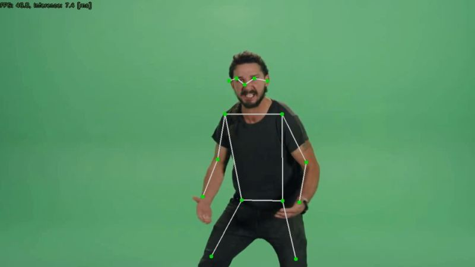

# Pose estimation (MoveNet/SinglePose/Lightning/v4) with TensorFlow Lite in C++
Sample project to run Pose estimation

Click the image to open in YouTube. https://youtu.be/9XP13y0P57w

## Target Environment, How to Build, How to Run
1. Please follow the instruction: https://github.com/iwatake2222/play_with_tflite/blob/master/README.md
2. Additional steps:
    - Download the model using the following script
        - https://github.com/PINTO0309/PINTO_model_zoo/blob/main/115_MoveNet/download_lightning_v4.sh
        - copy `saved_model/model_float32.tflite` to `resource/model/movenet_lightning.tflite`
    - Place  `resource/body.jpg`
        - https://user-images.githubusercontent.com/11009876/128474751-a8a51709-8c2d-483b-b6bf-db6cb2160496.jpg
    - Build  `pj_tflite_pose_movenet` project (this directory)

## Play more ?
- You can run the project on Windows, Linux (x86_64), Linux (ARM) and Android
- The project here uses a very basic model and settings
- You can try another model such as bigger input size, quantized model, etc.
    - Please modify `Model parameters` part in `pose_engine.cpp`
- You can try TensorFlow Lite with delegate
    - Please modify `Create and Initialize Inference Helper` part in `pose_engine.cpp` and cmake option
- You can try another inference engine like OpenCV, TensorRT, etc.
    - Please modify `Create and Initialize Inference Helper` part in `pose_engine.cpp` and cmake option

## Acknowledgements
- https://tfhub.dev/google/lite-model/movenet/singlepose/lightning/3
- https://github.com/PINTO0309/PINTO_model_zoo

